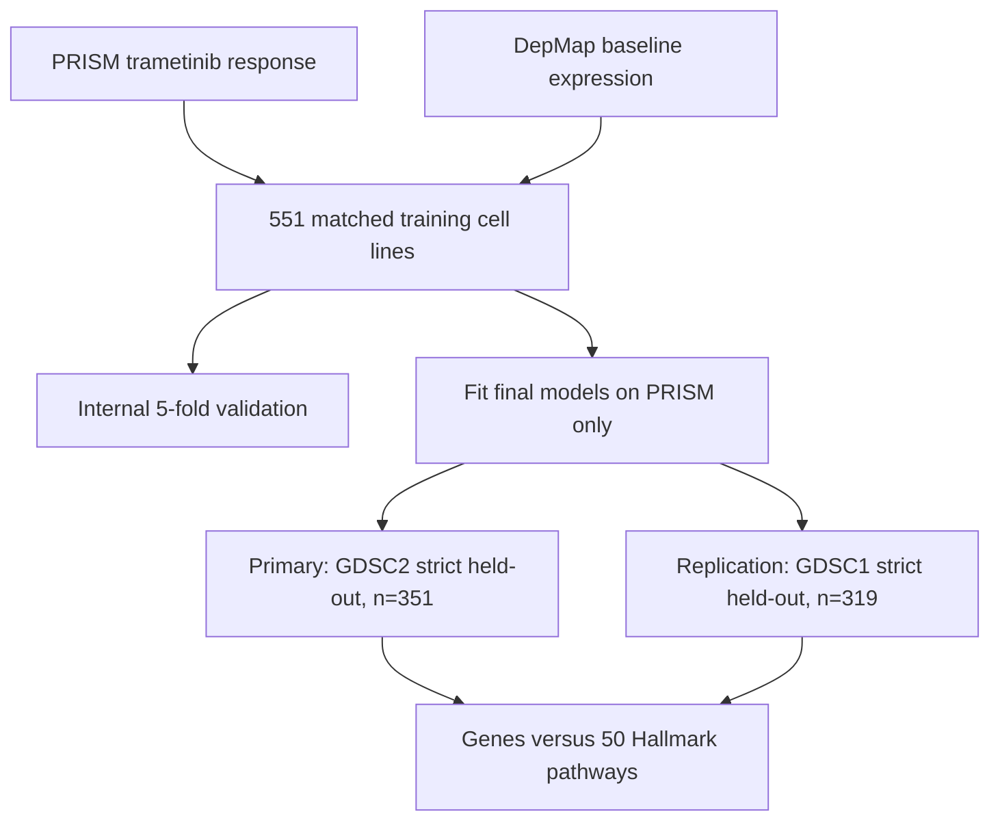
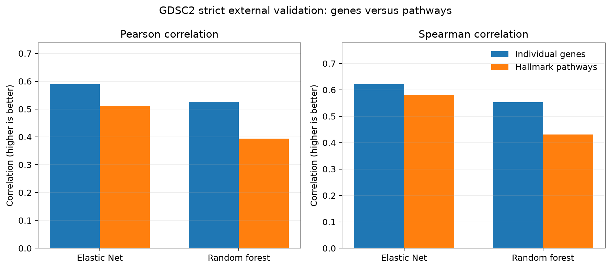

# Cross-dataset prediction of trametinib response

**A leakage-aware, one-drug proof of concept comparing individual-gene and Hallmark-pathway representations across PRISM/DepMap and GDSC.**

[](https://www.python.org/)
[](LICENSE)
[](#scope-and-limitations)

## Research question

Can baseline gene expression predict trametinib response in independent cancer cell-line datasets, and does compressing expression into biologically interpretable Hallmark pathway scores improve cross-dataset generalization?

The prespecified directional hypothesis was that pathway-level features would generalize better than selected individual genes. The hypothesis was **not supported** for trametinib: pathway models retained predictive signal, but individual-gene models were either better or statistically indistinguishable.

## Study design



- One modeling row represents one cancer cell line.
- Predictors are baseline gene-expression measurements or 50 Hallmark pathway scores.
- The training target is PRISM replicate-collapsed log-fold change after trametinib treatment.
- GDSC `LN_IC50` is the primary external outcome; GDSC `AUC` is secondary.
- GDSC outcomes are used only after predictions are generated.
- Cell-line identities seen during PRISM training are removed from strict external cohorts using the DepMap-to-Sanger model crosswalk.

## Main result

Primary strict external validation used 351 held-out GDSC2 cell lines with Sanger-derived expression.

| Representation | Model | Pearson r | Spearman rho |
|---|---|---:|---:|
| Individual genes | Elastic Net | **0.590** | **0.623** |
| Hallmark pathways | Elastic Net | 0.512 | 0.581 |
| Individual genes | Random Forest | **0.526** | **0.553** |
| Hallmark pathways | Random Forest | 0.393 | 0.431 |

For Elastic Net Pearson correlation, the pathway-minus-gene difference was **-0.078** (95% paired-bootstrap CI: **-0.144 to -0.015**), favoring individual genes. Across 32 paired metric comparisons spanning primary, replication, and sensitivity cohorts, 18 favored individual genes, 14 were uncertain, and none significantly favored pathways.



These correlations indicate cross-dataset association and ranking—not percentage accuracy, causal biomarkers, patient-response prediction, or clinical readiness.

## Data and feature audit

| Audit item | Measurement |
|---|---:|
| PRISM/DepMap training cell lines | 551 |
| DepMap raw gene columns | 19,205 |
| Common DepMap-GDSC gene symbols | 19,204 |
| Genes selected inside training | 1,000 |
| Genes contributing to pathway scores | 4,374 |
| Hallmark pathways | 50 |
| Strict held-out GDSC2 cell lines | 351 |
| Strict held-out GDSC1 cell lines | 319 |
| GDSC outcomes used during training | 0 |

## Repository map

```text
.
├── data/                 Download and placement instructions; no raw data
├── docs/                 Methods, results, data dictionary, and limitations
├── scripts/              Numbered analysis pipeline (00 through 12)
├── src/                  Reusable loading and modeling functions
├── tests/                Synthetic pipeline and public-result checks
└── results/
    ├── figures/          Final figures
    └── tables/           Aggregate metrics and audits
```

Start with [REPRODUCE.md](REPRODUCE.md). The exact data fields and joins are documented in [docs/DATA_DICTIONARY.md](docs/DATA_DICTIONARY.md).

## Installation

Using Conda:

```bash
conda env create -f environment.yml
conda activate pharmacogenomics
pytest -q
```

Alternatively:

```bash
python -m venv .venv
python -m pip install -r requirements.txt
pytest -q
```

## Data access

Raw DepMap, PRISM, GDSC, and MSigDB files are not redistributed in this repository. Obtain them from their providers and follow [data/README.md](data/README.md):

- [DepMap Data Portal](https://depmap.org/portal/data_page/)
- [PRISM Repurposing](https://depmap.org/repurposing/)
- [Genomics of Drug Sensitivity in Cancer](https://www.cancerrxgene.org/downloads/bulk_download)
- [Cell Model Passports downloads](https://cellmodelpassports.sanger.ac.uk/downloads)
- [MSigDB Hallmark gene sets](https://www.gsea-msigdb.org/gsea/msigdb/human/genesets.jsp?collection=H)

Users are responsible for complying with each provider's license, access conditions, and citation requirements.

## Scope and limitations

This is preliminary, non-peer-reviewed research on one drug in bulk-expression cancer cell lines. Cell lines do not reproduce patient tumors, immune interactions, pharmacokinetics, or treatment history. PRISM and GDSC measure response differently, so external comparisons emphasize correlation rather than cross-scale RMSE. The simple mean-z pathway representation may discard drug-specific signals. GDSC1 and GDSC2 share many biological models and should not be interpreted as fully independent patient-like cohorts.

See [docs/LIMITATIONS.md](docs/LIMITATIONS.md) for the complete statement.

## Reproducibility and AI-assistance disclosure

The committed tables and figures are aggregate derived outputs supporting the reported results. Row-level source outcomes and prediction files are generated locally but excluded from the public repository. Tests verify central cohort sizes, metrics, pathway counts, and the zero-outcome-leakage audit.

Generative AI was used to assist with code drafting, debugging, documentation, and quality-control planning. The author executed the analyses, inspected outputs, verified numerical claims against saved result files, and accepts responsibility for the repository. AI assistance does not substitute for independent scientific review.

## Author

**Franbon Ahmed Mohammed**  
MS in Business Analytics candidate, George Washington University  
[GitHub profile](https://github.com/FranbonAhmed)

## Citation

If you use this repository, cite the archived release generated from [CITATION.cff](CITATION.cff). Dataset and gene-set providers must also be cited under their own terms.
