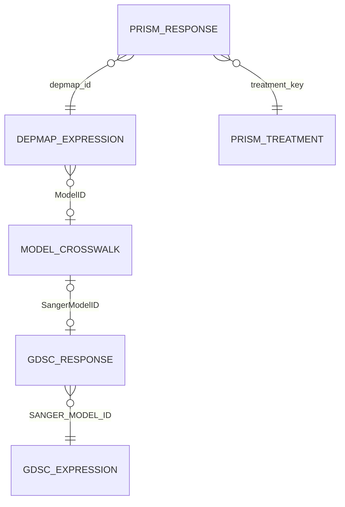

# Data dictionary and joins

## Modeling unit

For every fitted model, one row represents one cancer cell line. Stable model identifiers are used for joins and audits; spreadsheet row numbers are never used as keys.

## Key relationships

## Source tables

### DepMap expression

File: `OmicsExpressionProteinCodingGenesTPMLogp1.csv`

| Element | Meaning | Analysis role |
|---|---|---|
| One row | One DepMap cell-line model | Training observation |
| `ModelID` | ACH-format model identifier | Standardized to `depmap_id`; join key only |
| Gene columns such as `BRAF (673)` | Baseline log2(TPM+1) expression | Model predictors |

### PRISM response matrix

File: `primary-screen-replicate-collapsed-logfold-change.csv`

The raw table is a wide treatment-by-cell-line matrix. After reshaping:

| Clean column | Meaning | Analysis role |
|---|---|---|
| `treatment_key` | Computer identifier for the treatment | Join to treatment metadata |
| `depmap_id` | ACH-format cell-line identifier | Join to DepMap expression |
| `response` | Replicate-collapsed log-fold change | Training target `y` |

More negative PRISM values generally represent greater depletion and sensitivity.

### PRISM treatment metadata

File: `primary-screen-replicate-collapsed-treatment-info.csv`

Release-dependent source headers are standardized internally to:

| Clean column | Meaning |
|---|---|
| `treatment_key` | Key matching the response-matrix treatment row |
| `drug_name` | Human-readable compound name; used to select trametinib |

### PRISM cell-line metadata

File: `primary-screen-cell-line-info.csv`

| Column | Meaning | Analysis role |
|---|---|---|
| `depmap_id` | ACH-format model identifier | Key |
| `ccle_name` | Human-readable CCLE label | Identity audit |
| `primary_tissue` | Primary tissue label | Grouped validation, not a predictor |
| `secondary_tissue` | More specific tissue label | Descriptive audit |

### DepMap-Sanger model crosswalk

File: `Model.csv`

| Column | Meaning | Analysis role |
|---|---|---|
| `ModelID` | DepMap ACH identifier | Connect to training identities |
| `SangerModelID` | Sanger SIDM identifier | Connect to GDSC identities |
| `CellLineName`, `StrippedCellLineName`, `CCLEName` | Name variants | Secondary identity audit |

### GDSC response

Files: `GDSC1_fitted_dose_response_27Oct23.xlsx` and `GDSC2_fitted_dose_response_27Oct23.xlsx`

| Column | Meaning | Analysis role |
|---|---|---|
| `DATASET` | GDSC screen label | Dataset separation |
| `SANGER_MODEL_ID` | SIDM-format model identifier | Response-expression key |
| `CELL_LINE_NAME` | Human-readable model label | Identity audit/display |
| `DRUG_NAME` | Tested compound | Exact trametinib filter |
| `LN_IC50` | Natural log half-maximal inhibitory concentration | Primary external outcome |
| `AUC` | Area under fitted dose-response curve | Secondary external outcome |
| `RMSE` | Curve-fit error | Quality descriptor, not a feature |
| `CANCER_TYPE` | Cancer-type annotation | Descriptive, not a feature |
| `PUTATIVE_TARGET`, `PATHWAY_NAME` | Drug annotations | Documentation, not model inputs |

Within the combined derived response table, the practical key is `source_dataset + SANGER_MODEL_ID`, because a biological model can appear in both GDSC1 and GDSC2.

### GDSC/Cell Model Passports expression

File: `rnaseq_merged_rsem_tpm_20260323.csv`

The raw orientation is one gene per row and one cell-line model per column. Annotation fields include `gene_symbol`, `ensembl_gene_id`, and `gene_id`. Cell-line columns are identified by `model_id` metadata and transposed.

After transformation:

| Element | Meaning | Analysis role |
|---|---|---|
| One row | One SIDM cell-line model | External observation |
| `SANGER_MODEL_ID` | SIDM-format model identifier | Response-expression join key |
| Gene-symbol columns | Baseline expression | External model predictors |

Duplicate overlapping gene symbols are averaged before cross-platform alignment.

## Final matrices

| Matrix | Rows | Predictor columns | Outcome |
|---|---:|---:|---|
| PRISM/DepMap training, common genes | 551 | 19,204 | PRISM `response` |
| Gene model after training-only selection | 551 | 1,000 | PRISM `response` |
| Pathway model | 551 | 50 | PRISM `response` |
| Strict external GDSC2 | 351 | Aligned gene or pathway features | `LN_IC50`; `AUC` secondary |
| Strict replication GDSC1 | 319 | Aligned gene or pathway features | `LN_IC50`; `AUC` secondary |

Identifiers are indexes and audit fields—not predictors.

