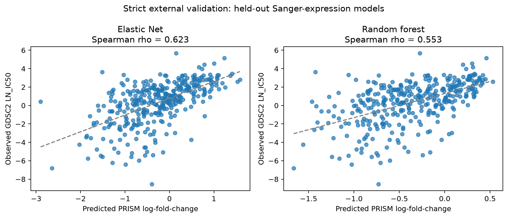
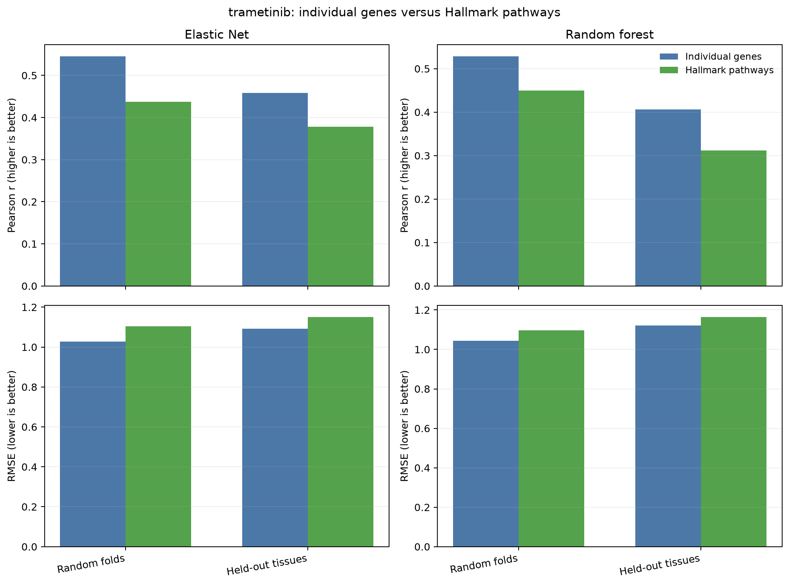

# Results

## Cohort and feature audit

The training join retained 551 PRISM/DepMap cell lines. DepMap supplied 19,205 raw gene columns. Cross-platform symbol processing produced 19,204 genes shared with GDSC. Gene models selected 1,000 features inside training. Pathway models used 50 Hallmark pathways containing 4,374 unique matched genes.

The primary strict external cohort contained 351 held-out GDSC2 models with Sanger-derived expression. The GDSC1 strict replication cohort contained 319 models. The audit reports zero GDSC outcomes used during model training.

## Internal validation

| Validation scheme | Model | Pearson r | Spearman rho | RMSE | MAE |
|---|---|---:|---:|---:|---:|
| Random cell-line folds | Elastic Net | 0.546 | 0.563 | 1.027 | 0.807 |
| Random cell-line folds | Random Forest | 0.529 | 0.546 | 1.044 | 0.830 |
| Held-out tissue folds | Elastic Net | 0.458 | 0.472 | 1.091 | 0.848 |
| Held-out tissue folds | Random Forest | 0.406 | 0.414 | 1.121 | 0.891 |

Performance decreased under held-out-tissue validation, consistent with a more difficult transfer setting. Elastic Net remained stronger than Random Forest on these summary metrics.

## Primary external validation

For GDSC2 `LN_IC50`, individual-gene Elastic Net achieved Pearson r=0.590 (95% bootstrap CI 0.515 to 0.657) and Spearman rho=0.623 (95% CI 0.547 to 0.685). Random Forest achieved Pearson r=0.526 and Spearman rho=0.553.

The positive direction is consistent with the response scales: greater trametinib sensitivity corresponds to lower PRISM log-fold change and lower GDSC `LN_IC50`.

## Gene-versus-pathway comparison

| Model | Gene Pearson | Pathway Pearson | Difference | 95% paired CI | Conclusion |
|---|---:|---:|---:|---|---|
| Elastic Net | 0.590 | 0.512 | -0.078 | -0.144 to -0.015 | Individual genes favored |
| Random Forest | 0.526 | 0.393 | -0.133 | -0.211 to -0.066 | Individual genes favored |

The Elastic Net Spearman difference was -0.042 with a 95% interval spanning zero, so that metric did not establish a representation advantage. Random Forest favored genes for both Pearson and Spearman.

Across the 32 paired Pearson/Spearman comparisons in the saved table, 18 favored genes, 14 were uncertain, and none significantly favored pathways.

## Scientific interpretation

Baseline expression contains a reproducible signal associated with trametinib response across these cell-line resources. A regularized linear representation transferred at least as well as the nonlinear forest in the tested settings. Broad Hallmark averaging compressed thousands of genes to 50 interpretable features and still predicted response, but it did not improve accuracy.

One plausible interpretation is that broad averaging discards specific expression patterns useful for trametinib. This is a hypothesis generated by the observed comparison, not a demonstrated mechanism.

## What the result does not establish

The results do not show that:

- The selected genes cause trametinib sensitivity.
- The models predict response in patients.
- The model is ready for clinical use.
- Pathway representations are generally inferior across drugs or diseases.
- A Pearson correlation of 0.590 means 59% accuracy.

The defensible conclusion is limited to a reproducible, one-drug, cancer-cell-line proof of concept.

